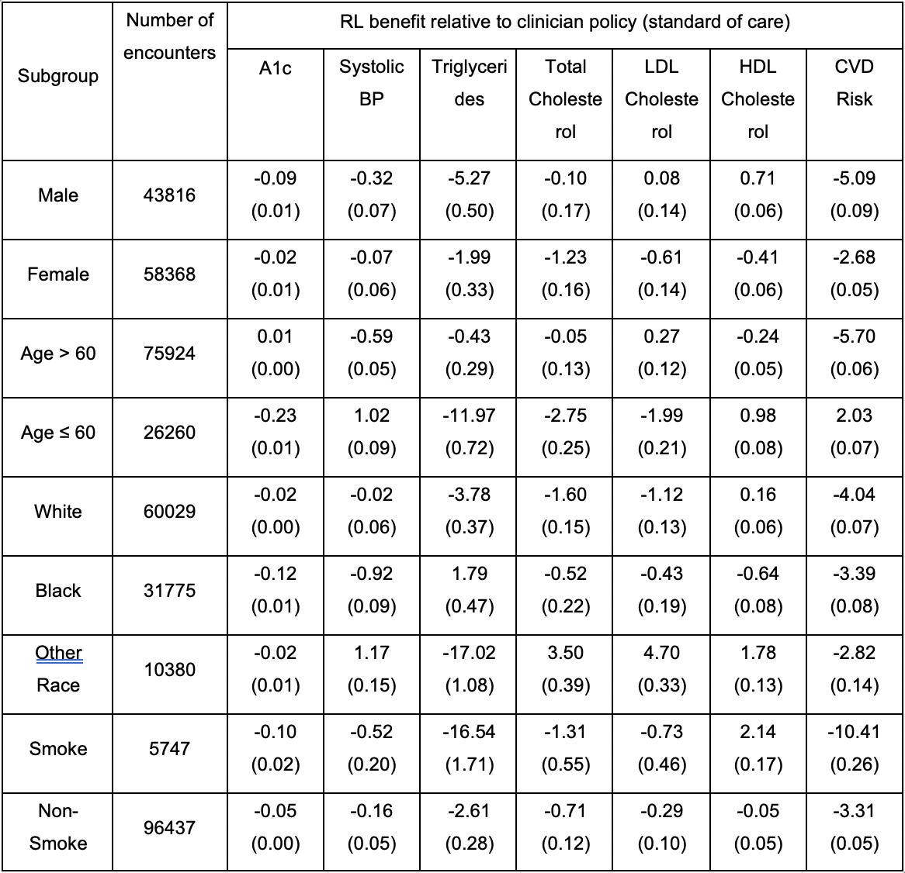

# EHR-RL
Repository for RL based prescriptive algorithm for the paper 
"Zheng, H., et al., In Press. Personalized multimorbidity management for patients with type 2 diabetes using reinforcement learning of electronic health records. Drugs."

The research was conducted by Hua Zheng and supervised by Professor Wei Xie, Professor Judy Zhong aand Professor Ilya O. Ryzhov. Results and publications are primarily coming out from Professor Wei Xie's research group. The paper has been accepted by Drugs and the preprint can be found in [paper](http://www1.coe.neu.edu/~wxie/RL_EHR_paper-2020.pdf). We would appreciate a citation if you use the code or results!

# Outline of our study:

* AIMS: Comorbid chronic conditions are common among people with type 2 diabetes. We developed an Artificial Intelligence algorithm, based on Reinforcement Learning (RL), for personalized diabetes and multimorbidity management with strong potential to improve health outcomes relative to current clinical practice.

* METHODS: We modeled glycemia, blood pressure and cardiovascular disease (CVD) risk as health outcomes using a retrospective cohort of 16,665 patients with type 2 diabetes from New York University Langone Health ambulatory care electronic health records in 2009 to 2017. We trained a RL prescription algorithm that recommends a treatment regimen optimizing patients’ cumulative health outcomes using their individual characteristics and medical history at each encounter. The RL recommendations were evaluated on an independent subset of patients. 

* RESULTS: The single-outcome optimization RL algorithms, RL-glycemia, RL-blood pressure, and RL-CVD, recommended consistent prescriptions with what observed by clinicians in 86.1%, 82.9% and 98.4% of the encounters. For patient encounters in which the RL recommendations differed from the clinician prescriptions, significantly fewer encounters showed uncontrolled glycemia (A1c>8% on 35% of encounters), uncontrolled hypertension (blood pressure > 140mmHg on 16% of encounters) and high CVD risk (risk > 20% on 25% of encounters) under RL algorithms than those observed under clinicians (43%, 27% and 31% of encounters respectively; all P < 0.001).  

* CONCLUSIONS: A personalized reinforcement learning prescriptive framework for type 2 diabetes yielded high concordance with clinicians’ prescriptions and substantial improvements in glycemia, blood pressure, cardiovascular disease risk outcomes.

# Main Results
## Higher Efficacy
RL based prescriptions significantly improves patients' health outcomes and reduce the number of patients in serious conditions, i.e. SBP > 140 mmHg HbA1c > 8% and FHS CVD risk > 20%.
| __RL-glycemia__                                                                                        |                   |                          |         |
|--------------------------------------------------------------------------------------------------------|-------------------|--------------------------|---------|
| Encounters for which algorithm’s recommendation differed from observed Clinician's prescription (N(%)) | 15,578 (13.9)     |                          |         |
|                                                                                                        | RL-glycemia       | Clinician's prescription | P-value |
| A1c (Mean(SE))                                                                                         | 7.80 (0.01)       | 8.09 (0.01)              | <0.001  |
| A1c > 8% (N(%))                                                                                        | 5,421 (34.8)      | 6,617 (42.5)             | <0.001  |
| 
 __RL-Blood Pressure__                                                             |                   |                          |         |
| Encounters for which algorithm’s recommendation differed from observed Clinician's prescription (N(%)) | 20,251 (17.1)     |                          |         |
|                                                                                                        | RL-BP             | Clinician's prescription | P-value |
| SBP(Mean(SE))                                                                                          | 131.77(0.06)      | 132.35 (0.11)            | <0.001  |
| SBP > 140 mmHg (N(%))                                                                                  | 3,256 (16.1)      | 5,390 (26.6)             | <0.001  |
| RL-CVD                                                                                                 |                   |                          |         |
| Encounters for which algorithm’s recommendation differed from observed Clinician's prescription (N(%)) | 946 (1.6)         |                          |         |
|                                                                                                        | RL-CVD            | Clinician's prescription | P-value |
| FHS (Mean(SE))                                                                                         | 13.65 (0.26)      | 17.18 (0.36)             | <0.001  |
| FHS > 20% (N(%))                                                                                       | 237 (25.1)        | 299 (31.6)               | <0.001  |
| 
 __RL-multimorbidity__                                                             |                   |                          |         |
| Encounters for which algorithm’s recommendation differed from observed Clinician's prescription (N(%)) | 102,184 (28.9)    |                          |         |
|                                                                                                        | RL-multimorbidity | Clinician's prescription | P-value |
| A1c (Mean(SE))                                                                                         | 7.14 (0.003)      | 7.19 (0.005)             | <0.001  |
| A1c > 8% (N(%))                                                                                        | 16,436 (16.08)    | 20,879 (20.43)           | <0.001  |
| SBP (Mean(SE))                                                                                         | 129.40 (0.03)     | 129.58 (0.05)            | <0.001  |
| SBP > 140 mmHg (N(%))                                                                                  | 9,800 (9.59)      | 20,957 (20.51)           | <0.001  |
| FHS (Mean(SE))                                                                                         | 21.89 (0.04)      | 25.61 (0.05)             | <0.001  |
| FHS > 20% (N(%))                                                                                       | 48,283 (47.3)     | 55,957 (54.8)            | <0.001  |

## Less prescriptions
Both AI and doctor has similar prescriotive distribution but AI tends to prescribe less than doctors:

## Consistently performance acrosss different groups

